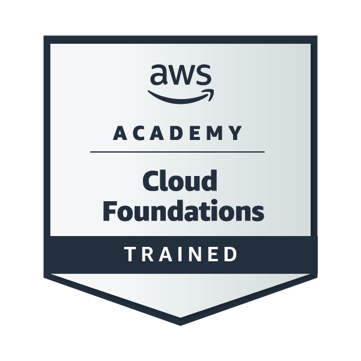

<div align="center">


<br>

<a href="https://github.com/RishabhDimri">

</a>
<a href="https://www.linkedin.com/in/rishabh-dimri/">

</a>
<a href="https://leetcode.com/u/RishabhDimri/">

</a>
<a href="https://rishabh-portfolio-silk.vercel.app/">

</a>

<br>


</div>

---

<div align="center">

<table>
<tr>
<td align="center">

<br>
<b>BACKEND</b>
<br>
<sub>Java · Spring Boot · REST</sub>
</td>
<td align="center">

<br>
<b>FRONTEND</b>
<br>
<sub>React · Vite</sub>
</td>
<td align="center">

<br>
<b>REACT NATIVE</b>
<br>
<sub>Mobile Apps · APIs</sub>
</td>
<td align="center">

<br>
<b>DATABASE</b>
<br>
<sub>PostgreSQL · MySQL</sub>
</td>
<td align="center">

<br>
<b>DSA</b>
<br>
<sub>Java · Python</sub>
</td>
</tr>
</table>

</div>

---

<div align="center">


</div>

---

# 🧑‍💻 About Me

<div align="center">

<table>
<tr>

<td width="55%" valign="middle">

### ⚡ Software Engineer

I build **backend and full-stack applications** primarily with **Java, Spring Boot and PostgreSQL**, while also working with **React and React Native** to build web and mobile experiences.

I enjoy building complete systems — from **database design and REST APIs to business logic, web interfaces and mobile applications**.

Currently focused on **backend architecture, LLD, System Design and scalable applications**.

`Design` → `Build` → `Integrate` → `Test` → `Ship`

</td>

</tr>
</table>

</div>

---

# ⚙️ Engineering Stack

<div align="center">

<table>
<tr>

<td width="25%" align="center">

### ☕ BACKEND


`Java`
`Spring Boot`
`Spring REST`
`JDBC`
`JWT`
`OpenAPI`
`Swagger`

</td>

<td width="25%" align="center">

### ⚛️ FRONTEND


`React`
`Vite`
`REST Integration`
`Responsive UI`

</td>

<td width="25%" align="center">

### 📱 REACT NATIVE


`React Native`
`Mobile UI`
`API Integration`
`Performance`

</td>

<td width="25%" align="center">

### 🗄️ DATABASE


`PostgreSQL`
`MySQL`
`Oracle SQL`
`Database Design`

</td>

</tr>
</table>

<br>


<br>


</div>

---

# 🚀 Featured Project

<div align="center">


<br>

<a href="https://github.com/RishabhDimri/expense-tracker-frontend">

</a>
<a href="https://github.com/RishabhDimri/expense-tracker-backend">

</a>

</div>

<table>
<tr>

<td width="50%" valign="top">

### 🎨 Ledgerly Frontend

Modern personal finance dashboard with an editorial interface, responsive design and light/dark themes.

**Features**

- 🔐 Secure authentication
- 🪪 JWT authentication
- 💸 Income & expense tracking
- ✏️ Transaction CRUD
- 📜 Transaction history
- 📊 Financial analysis
- 🏷️ Category management
- 🧩 Custom categories
- 💰 Monthly budgets
- 📈 Budget monitoring
- 📱 Mobile-friendly UI
- 🌙 Light & dark themes
- 🔄 API integration
- 🛡️ Protected routes
- ⚡ Loading & error states

**Stack:** `React` `Vite` `REST API`

</td>

<td width="50%" valign="top">

### ⚙️ Ledgerly Backend

Spring Boot 3 REST API for authentication, transactions, budgets, categories, analytics and financial reporting.

**Features**

- 🔐 JWT authentication
- 👤 Registration & login
- 🔄 Access & refresh tokens
- 🔑 Password management
- 💸 Transaction management
- 📊 Transaction analysis
- 🏷️ Category management
- 💰 Monthly budgets
- 📈 Financial summaries
- 📄 PDF statements
- 📑 Monthly reports
- 📚 Pagination & sorting
- 🔎 OpenAPI 3.1
- 🧪 Swagger UI

**Stack:** `Java` `Spring Boot 3` `PostgreSQL` `JWT`

</td>

</tr>
</table>

### 🏗️ Architecture


```text
                         ┌─────────────────────┐
                         │       LEDGERLY      │
                         └──────────┬──────────┘
                                    │
                                    ▼
                     ┌─────────────────────────┐
                     │       REACT + VITE      │
                     │         FRONTEND        │
                     ├─────────────────────────┤
                     │ Dashboard               │
                     │ Transactions            │
                     │ Budgets                 │
                     │ Categories              │
                     │ Analytics               │
                     └────────────┬────────────┘
                                  │
                                  │ REST / HTTPS
                                  ▼
                     ┌─────────────────────────┐
                     │       SPRING BOOT 3     │
                     │           API           │
                     ├─────────────────────────┤
                     │ JWT Security            │
                     │ Transaction Service     │
                     │ Budget Service          │
                     │ Category Service        │
                     │ Analytics               │
                     │ PDF Reports             │
                     └────────────┬────────────┘
                                  │
                                  │ JPA / SQL
                                  ▼
                     ┌─────────────────────────┐
                     │       POSTGRESQL        │
                     │        SUPABASE         │
                     └─────────────────────────┘
```

<div align="center">

<a href="https://github.com/RishabhDimri/expense-tracker-frontend">

</a>
<a href="https://github.com/RishabhDimri/expense-tracker-backend">

</a>

</div>

---

# 🧩 Other Projects

<table>
<tr>

<td width="50%" valign="top">

### 🎬 MovieFlix

`React Native`

Movie browsing application with API integration for reviews, summaries and genre-based content.

**Focus:** API integration · Mobile UI · State management · Performance

</td>

<td width="50%" valign="top">

### 🚆 Sanchari

`Java` `JDBC` `Oracle SQL`

Online train reservation system supporting schedules, seat availability and booking management.

**Focus:** Java · JDBC · SQL · Booking logic

</td>

</tr>

<tr>

<td width="50%" valign="top">

### 🎰 Lottery_Khelo

`React` `Solidity` `Ethereum`

Decentralized lottery application using Ethereum smart contracts and MetaMask.

**Focus:** Solidity · Smart Contracts · MetaMask · Web3

</td>

<td width="50%" valign="top">

### 🤖 Enterprise Automation

`Blue Prism`

Enterprise automation workflows supporting production operations and incident resolution.

**Focus:** Automation · Monitoring · Debugging · Production Support

</td>

</tr>
</table>

---

# 🧠 DSA & Problem Solving

<div align="center">


<br>

<a href="https://leetcode.com/u/RishabhDimri/">

</a>

</div>

---

# 💼 Professional Journey

### 🏢 Software Engineer — Capgemini

`August 2025 – Present`

Working on enterprise automation workflows for **Siemens**.

- Monitor and maintain production automation workflows
- Investigate and resolve production issues
- Debug and enhance existing workflows
- Implement client change requests
- Support reliable enterprise automation operations

**Environment:** `Blue Prism` `Enterprise Automation` `Production Support`

### 📱 React Native Developer Intern — QUADB Technologies

`February 2025 – July 2025`

Worked on mobile application development and system integration using **React Native**, with exposure to API-driven applications and blockchain connectivity.

- Developed and enhanced mobile application features using React Native
- Built responsive and reusable mobile UI components
- Integrated REST APIs and external services
- Worked on application performance optimization
- Implemented system integrations based on business requirements
- Worked with blockchain connectivity and Web3-related functionality

**Tech:** `React Native` `React.js` `REST APIs` `JavaScript` `Blockchain` `Web3`

---

# 🏅 Featured Credentials

<div align="center">

<table>
<tr>

<td align="center" width="20%">
<a href="https://www.credly.com/badges/b1c50c84-2295-455f-8e6e-4fec49e90baf/public_url">

</a>
<br>
<b>Claude</b>
<br>
<sub>Certified Associate</sub>
</td>

<td align="center" width="20%">
<a href="https://www.credly.com/badges/71421651-6fd9-47e4-85fb-00e7d6faec0c/public_url">

</a>
<br>
<b>Google Cloud</b>
<br>
<sub>Kubernetes</sub>
</td>

<td align="center" width="20%">
<a href="https://www.credly.com/badges/4a545e6d-e14f-472b-9634-829bfbae7ed9/public_url">

</a>
<br>
<b>Google Cloud</b>
<br>
<sub>Cloud Data</sub>
</td>

<td align="center" width="20%">
<a href="https://www.credly.com/badges/1d373328-2e46-4a55-bc93-23e14c0ddf5b/public_url">

</a>
<br>
<b>Google Cloud</b>
<br>
<sub>Serverless</sub>
</td>

<td align="center" width="20%">
<a href="https://www.credly.com/badges/978a8322-7a59-4008-a1a3-816ec70a6c30/public_url">

</a>
<br>
<b>AWS</b>
<br>
<sub>Cloud Foundations</sub>
</td>

</tr>
</table>

<br>


<br>

<a href="https://www.credly.com/users/rishabh-dimri-risam">

</a>

</div>


---


# 🏆 Highlights

<div align="center">

<table>
<tr>

<td align="center">
  <h3>🧠</h3>
  <strong>1,095+</strong><br>
  LeetCode Problems
</td>

<td align="center">
  <h3>🎓</h3>
  <strong>9.2 / 10</strong><br>
  B.Tech CGPA
</td>

<td align="center">
  <h3>🏆</h3>
  <strong>Hackathons</strong><br>
  Team Leadership
</td>

<td align="center">
  <h3>👨‍💻</h3>
  <strong>100+</strong><br>
  Students Reached
</td>


</tr>
</table>

</div>

- 🚀 Led teams in hackathons across healthcare, sustainability and AR/VR
- ☁️ Completed Google Cloud and AWS training programs
- 👨‍💻 Organized Terror of Error, a coding fest for 100+ first-year students
- ☁️ Organized monthly cloud technology discussions through Cloud Shastra Club

---


# 📊 GitHub Analytics

<div align="center">


</div>

---

# 🌱 Currently Learning

<div align="center">

<table>
<tr>

<td width="33%" align="center">

### 🏗️ SYSTEM DESIGN

Scalable Services
<br>
Distributed Systems
<br>
Caching
<br>
Load Balancing

</td>

<td width="33%" align="center">

### 🧱 LOW LEVEL DESIGN

SOLID
<br>
Design Patterns
<br>
Clean Architecture
<br>
OOP

</td>

<td width="33%" align="center">

### ☕ SPRING

Spring Security
<br>
Spring Boot
<br>
REST APIs
<br>
Backend Architecture

</td>

</tr>
</table>


</div>

---

# 🎓 Education

<div align="center">

### Noida Institute of Engineering & Technology

**Bachelor of Technology — Computer Science**

`August 2021 – May 2025`


</div>

---

# 📬 Connect With Me

<div align="center">

<a href="https://github.com/RishabhDimri">

</a>
<a href="https://www.linkedin.com/in/rishabh-dimri/">

</a>
<a href="https://leetcode.com/u/RishabhDimri/">

</a>
<a href="https://rishabh-portfolio-silk.vercel.app/">

</a>
<a href="mailto:rishu.dimri04@gmail.com">

</a>


</div>
